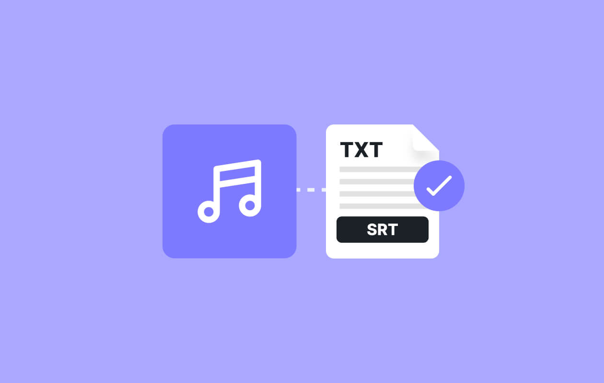

<a id="readme-top"></a>


[](https://img.shields.io/github/license/rerealising/transcript-summarizer?style=for-the-badge&link=https%3A%2F%2Fgithub.com%2Frerealising%2Ftranscript-summarizer%2Fblob%2Fmain%2FLICENSE)

<!-- HEADER -->
<br />
<div align="center">
  <a href="https://github.com/rerealising/transcript-summarizer">
    
  </a>

<h3 align="center">transcript summarizer</h3>

  <p align="center">
    a simple web app solution for lazy students 😴
    <br />
    <a href="https://github.com/rerealising/transcript-summarizer"><strong>Explore the docs »</strong></a>
    <br />
    <br />
    <a href="#usage">View Demo</a>
    ·
    <a href="https://github.com/rerealising/transcript-summarizer/issues/new?labels=bug&template=bug-report---.md">Report Bug</a>
    ·
    <a href="https://github.com/rerealising/transcript-summarizer/issues/new?labels=enhancement&template=feature-request---.md">Request Feature</a>
  </p>
</div>

<br />

<!-- TABLE OF CONTENTS -->
<details>
  <summary>&nbsp;Table of Contents</summary>
  <ol>
    <li>
      <a href="#about-the-project">About The Project</a>
    </li>
    <li>
      <a href="#getting-started">Getting Started</a>
      <ul>
        <li><a href="#set-up-source-code-manual">Manual Installation</a></li>
      </ul>
    </li>
    <li><a href="#roadmap">Roadmap</a></li>
    <li><a href="#contributing">Contributing</a></li>
    <li><a href="#license">License</a></li>
    <li><a href="#contact">Contact</a></li>
    <li><a href="#acknowledgments">Acknowledgments</a></li>
  </ol>
</details>

<!-- ABOUT THE PROJECT -->
## About The Project

This is a web app designed to generate concise notes from a lecture transcript, powered by Google Gemini. The transcript may be sourced manually, through an existing API endpoint <i>(currently, only YouTube is supported)</i><s>, or scraped from Echo360 through a TamperMonkey integration</s>. Echo360 integration has been deprecated - updated UI means the previously written integration no longer works, and transcripts can now be directly downloaded from echo360.

<b>Please note that this project currently requires you to provide your own Google Gemini API key!</b>

<i> This project was created for an assignment, and this is not actively maintained. Bug reports and feature requests may only be addressed due to popular demand.</i>

<p align="right">(<a href="#readme-top">back to top</a>)</p>

<!-- GETTING STARTED -->
## Getting Started

You currently must run the program by downloading the source code and manually installing dependencies.

### Set-up (source code, manual)

<i>These steps require you to have a intermediate computational skills, so you may need to ask for help!</i>

1. Install the latest version of Python.

2. [Download](https://github.com/rerealising/transcript-summarizer/releases) the `.zip` package.

3. Through your system terminal, install these dependencies: 
    ```
    pip install flask google-generativeai pyhtml pandas youtube_transcript_api tldextract urllib marko shortuuid
    ```

4. Create a Gemini API key in the [Google AI Studio](https://aistudio.google.com/app/apikey). 

5. Replace your key into line 4 of `func.py`:
   ```
   gemini.configure(api_key='YOUR_KEY_HERE')
   ```

6. Run `master.py`. The app can be accessed at `localhost:50001`.

<p align="right">(<a href="#readme-top">back to top</a>)</p>

<!-- ROADMAP -->
## Roadmap

- [ ] support for direct transcription of video files

See the [open issues](https://github.com/rerealising/transcript-summarizer/issues) for a full list of potential future features (and known issues).

<p align="right">(<a href="#readme-top">back to top</a>)</p>

<!-- CONTRIBUTING -->
## Contributing

Contributions are what make the open source community such an amazing place to learn, inspire, and create. Any contributions you make are **greatly appreciated**.

If you have a suggestion that would make this better, please fork the repo and create a pull request. You can also simply open an issue with the tag "enhancement".
Don't forget to give the project a star! Thanks again!

1. Fork the Project
2. Create your Feature Branch (`git checkout -b feature/AmazingFeature`)
3. Commit your Changes (`git commit -m 'Add some AmazingFeature'`)
4. Push to the Branch (`git push origin feature/AmazingFeature`)
5. Open a Pull Request

<p align="right">(<a href="#readme-top">back to top</a>)</p>

<!-- LICENSE -->
## License

Distributed under the GNU GPL v3.0 License. See [`LICENSE`](/LICENSE) for more information.

<p align="right">(<a href="#readme-top">back to top</a>)</p>


<!-- CONTACT -->
## Contact

rere - [@rerealising](https://x.com/rerealising) - rerealising@gmail.com

Project Link: [https://github.com/rerealising/transcript-summarizer](https://github.com/rerealising/transcript-summarizer)

<p align="right">(<a href="#readme-top">back to top</a>)</p>


<!-- ACKNOWLEDGMENTS -->
## Acknowledgments

* [Flask](https://flask.palletsprojects.com/en/stable/)
* [Gemini](https://deepmind.google/technologies/gemini/)

<p align="right">(<a href="#readme-top">back to top</a>)</p>